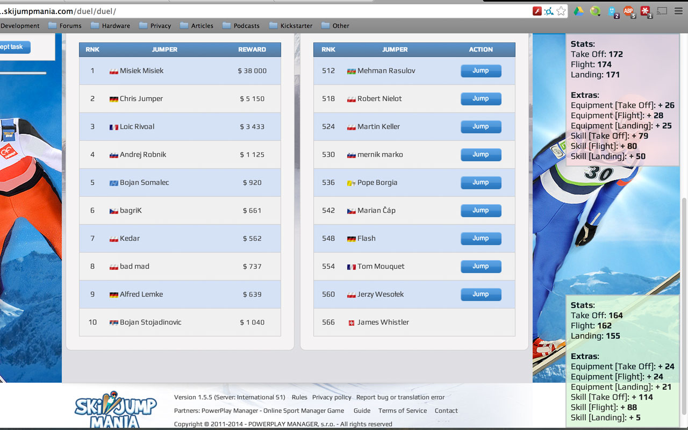
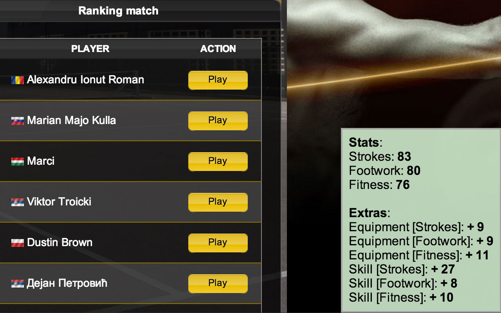

This Chrome Extension adds a simple MouseOver-Event to all Jump/Play buttons. When moving your mouse over such a button, the extension will load player information in the backgroud, e.g., 

* Opponent's / Your Stats
* Opponent's / Your Skills
* Opponent's / Your Equipment
* ...

